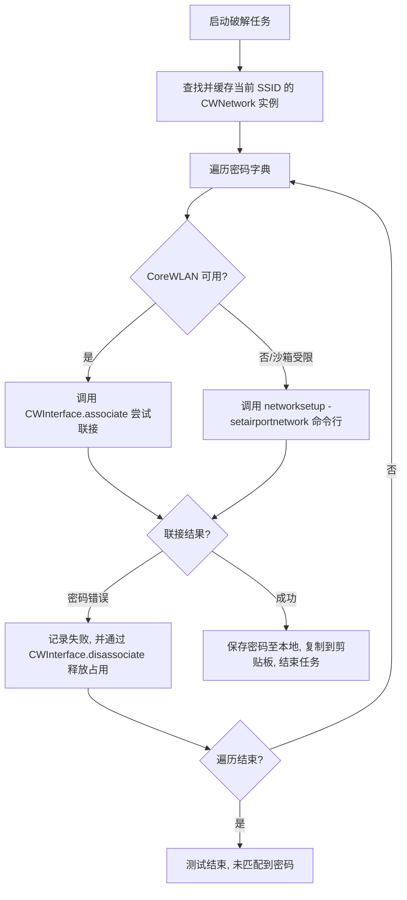

# WiFi 借一下 (HiWiFi)

<p align="center">
  <br>
  <strong>macOS 原生 WiFi 密码安全测试与强度评估工具</strong><br>
  <em>Native macOS WiFi Password Security Testing & Assessment Tool</em>
</p>

<p align="center">
  <a href="https://developer.apple.com/macos/"></a>
  <a href="https://developer.apple.com/swift/"></a>
  <a href="https://developer.apple.com/xcode/swiftui/"></a>
  <a href="LICENSE"></a>
</p>

---

## 📖 简介 | Introduction

**WiFi 借一下 (HiWiFi)** 是一款专为 macOS 平台设计的原生 WiFi 密码测试工具，旨在帮助网络管理员和安全人员评估无线网络的密码强度。

本项目完全采用 Swift 与 SwiftUI 编写，深度适配 macOS 26 Tahoe 风格设计语言（三栏式 Liquid Glass 玻璃材质界面）。针对 macOS 严格的权限和硬件接口限制，本项目通过集成底层 CoreWLAN 框架并配备系统命令行后备测试链，实现了高效且安全的本地 WiFi 密码测试。

**HiWiFi** is a native macOS application designed for WiFi password security auditing and strength evaluation. Built from scratch with Swift and SwiftUI, it features a modern three-column Liquid Glass design and runs entirely locally. It integrates Apple's CoreWLAN framework with a robust CLI fallback chain to safely navigate macOS security restrictions.

---

## ✨ 功能特性 | Features

* **📡 实时网络扫描**：动态获取周围 WiFi 的 SSID、BSSID、信道、安全类型（WPA/WPA2/WPA3）及精确的 RSSI 信号分级。
* **⚡ 极速握手测试**：**【核心优化】** 引入 `CWNetwork` 实例缓存，避免每次密码尝试都进行耗时 2~3 秒的重复网络扫描。
* **🤖 智能多路 Fallback**：首选高集成度的 CoreWLAN 框架联接；当遇到系统环境或权限异常时，智能无缝切入系统的 `networksetup` 命令行安全旁路。
* **⏱️ 精准用时控制**：基于主 RunLoop 的 Cocoa Timer 计时器，与测试状态绑定，支持“暂停/恢复”时计时器的自动步进同步。
* **📊 动态速率统计**：支持起步防尖峰滤波。在每秒测试数（p/s）低于 1.0 时，自动转化为以分钟为单位（`个/分`），读数更贴合慢速握手环境。
* **🔒 安全与隐私**：所有密码测试与记录完全在本地运行与存储，无任何网络上传行为，保障物理安全性。
* **🎨 现代 macOS 体验**：
  * 精美的三栏式自适应布局，锁定左右两栏尺寸，防挤压变形。
  * 进度环百分比基线对齐显示，适配系统深色与浅色模式。

---

## 🛠️ 技术架构 | Technical Architecture

HiWiFi 的密码测试管线经过了精心设计，以规避 macOS 的沙箱和硬件占用限制：



> [!IMPORTANT]
> **关于 macOS 定位服务权限 (Location Services)**
> 根据 Apple 安全要求，自 macOS 14 起，获取当前及扫描到的 WiFi SSID 信息属于位置隐私。**应用首次启动时会请求位置权限**，只有在允许位置服务后，CoreWLAN 才能返回正确的 SSID 列表（否则将只能扫描到空白 SSID 占位符）。

---

## 📦 安装与运行 | Installation

### 方式一：使用预编译的 DMG 镜像

1. 前往项目 [Releases](../../releases) 页面下载最新的 `HiWiFi.dmg` 镜像。
2. 双击打开 [HiWiFi.dmg](dist/HiWiFi.dmg)，将 **WiFi借一下** 图标拖拽至 `Applications` 文件夹中。
3. 首次启动如提示“无法打开未开发者签名的软件”，请前往系统的 **「设置」->「隐私与安全性」** 手动允许运行。

### 方式二：从源码编译构建

本仓库支持使用 **Xcode 完整项目构建** 或 **Command Line Tools (无 Xcode.app 独立环境)** 两种模式编译。

#### 1. 前置环境要求
* **macOS 14.0 (Sonoma)** 或更高版本
* 安装有 **Swift 6.0 / Swiftc** 编译器
* 安装有 `xcodegen`（用于生成 Xcode 工程文件，如无 Xcode 可跳过）

#### 2. 生成工程与编译
使用我们提供的 `build.sh` 脚本，可以自动适配您的环境并完成构建：

```bash
# 克隆本仓库
git clone https://github.com/CuoStudio/HiWiFi.git
cd HiWiFi

# 赋予构建脚本执行权限
chmod +x scripts/build.sh

# 模式 A: 编译 Debug 调试包
./scripts/build.sh

# 模式 B: 编译 Release 生产包并生成 DMG 安装介质
./scripts/build.sh --dmg
```

构建完成后，生成的应用程序包位于 `build/HiWiFi.app`，DMG 安装包位于 `dist/HiWiFi.dmg`。

---

## ⚠️ 法律声明 | Legal Disclaimer

### 中文
> **【重要提示】本软件仅供网络安全教学、个人网络评估及授权渗透测试用途。**
> 
> 在未获得明确书面授权的情况下，使用本工具测试或入侵任何非您本人的 WiFi 网络属于**违法行为**。由此产生的任何直接或间接法律责任均由使用者本人承担，开发者及 `CuoStudio` 不对任何滥用导致的后果负责。

### English
> **【Notice】This software is intended for educational, authorized security auditing, and penetration testing purposes only.**
> 
> Attacking or testing wireless networks without the owner's explicit written consent is **strictly prohibited and illegal** under computer crime laws in most jurisdictions. The users assume all liability and consequences resulting from the misuse of this tool. The developers and `CuoStudio` assume no responsibility for any damage or legal issues caused by improper use.

---

## 📄 开源协议 | License

本项目基于 [MIT License](LICENSE) 协议开源。

---

## 🙏 致谢 | Credits

* [wifi-crack-tool-main](https://github.com/wifi-crack-tool-main) - 提供了项目最初的想法与字典参考。
* [Apple CoreWLAN API](https://developer.apple.com/documentation/corewlan) - 官方无线局域网交互接口。

<p align="center">
  <sub>Made with ❤️ by <a href="https://github.com/CuoStudio">CuoStudio</a></sub>
</p>
